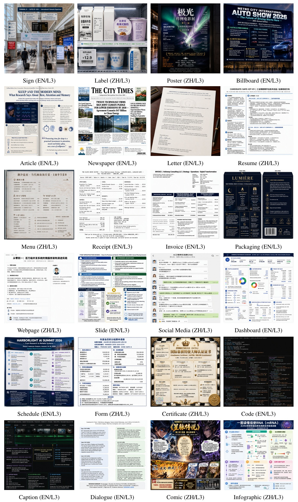
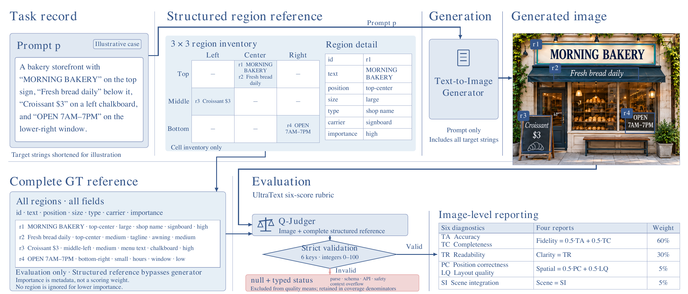

<h1 align="center">UltraText Bench</h1>
<p align="center"><b>A Comprehensive Bilingual Benchmark for Evaluating Visual Text Rendering in Image Generation</b></p>

<p align="center">
Deyuan Liu<sup>†</sup> · Yihao Hu<sup>†</sup> · Jingxuan Zhang<sup>†</sup> · Xingying Li<sup>†</sup> · Jun Xie<sup>†</sup><br>
Jiacheng Liu · Jungang Li · Yu Huang · Xuanyi Liu · Yue Ding · Zecheng Wang<br>
Lei Zhao · Mingda Wang · Zhenglin Cheng · Peng Sun · Tao Lin<sup>*</sup>
</p>
<p align="center">
Westlake University · Ant Group · Zhejiang University · Shanghai Innovation Institute<br>
HKUST · CASIA · Wechat AI · MBZUAI · CityU · Peking University<br>
<sup>†</sup> Equal contribution &nbsp; <sup>*</sup> Corresponding author
</p>
<p align="center">
<a href="https://lins-lab.github.io/UltraText_Bench/"></a>
<a href="https://arxiv.org/abs/2610.09823"></a>
<a href="https://huggingface.co/papers/2610.09823"></a>
</p>
<p align="center">
<a href="https://lins-lab.github.io/UltraText_Bench/">Project page</a> ·
<a href="data">Dataset</a> ·
<a href="#leaderboard">Leaderboard</a> ·
<a href="#quick-start">Quick start</a>
</p>

**UltraText Bench tests whether image generators can reproduce dense English and Chinese text across an entire scene.** A convincing title is only part of the task: body text, prices, labels, and small supporting regions must also preserve the requested content and placement.

The benchmark contains **432 prompts**, **24 scene categories**, **three difficulty levels**, and **2,926 annotated text regions**. English and Chinese each contain 216 prompts. Every generation prompt supplies all target strings; the structured region reference is used by the evaluator.

<p align="center">

<br><em>L3 scene coverage: one selected GPT Image 2 output per category at API quality Low, reproduced from Figure 1. These examples illustrate the tasks; they are not human correctness labels.</em>
</p>

## What is included

- The complete [English](data/en_prompts.jsonl) and [Chinese](data/zh_prompts.jsonl) prompt records, including target strings, region positions, relative sizes, roles, carriers, and importance.
- Generation runners for Qwen-Image and Z-Image, plus an explicitly configured GPT Image gateway adapter.
- The Q-Judger evaluation client, complete-reference rubric, response validation, score aggregation, and coverage reporting.
- Dataset audit snapshots, regression tests, and the current [paper](paper/README.md).

This repository accompanies [UltraText Bench (arXiv:2610.09823)](https://arxiv.org/abs/2610.09823).

## Benchmark

The 24 categories span signs and labels, documents and print, commercial materials, digital interfaces, structured data, and creative scenes. Each category has three prompts at each difficulty level in each language.

- **L1 (Hard):** four to seven regions per prompt.
- **L2 (Very Hard):** five to ten regions per prompt.
- **L3 (Extreme):** seven to twelve regions per prompt; English examples contain up to 5,230 target characters.

Difficulty levels group different prompts and workloads. They are not controlled edits of the same scene. Character counts include spaces and punctuation; a region may contain multiple lines. See [dataset statistics](docs/dataset_stats.md) for the exact distributions.

<p align="center">

</p>

Q-Judger returns six integer ratings from 0 to 100. They form four reported dimensions:

```text
Fidelity  = (text_accuracy + text_completeness) / 2
Clarity   = text_readability
Spatial   = (position_correctness + layout_quality) / 2
Scene     = scene_integration
Composite = 0.60 × Fidelity + 0.30 × Clarity + 0.05 × Spatial + 0.05 × Scene
```

Only successful, schema-valid ratings enter quality means. Missing images and evaluation failures remain in coverage counts with null scores. The primary mean first averages successful images within each prompt, then averages represented prompts equally. The bilingual result gives equal weight to the English and Chinese prompt-macro means.

## Leaderboard

<!-- LEADERBOARD:START -->

Reported results for **24 model configurations**, transcribed from the paper. Ratings range from 0 to 100; higher is better. Overall scores average EN/ZH prompt-macro means equally. Each group is ordered by Composite; bold marks the best value in that group.

Composite weights are 60/30/5/5 for Fidelity/Clarity/Spatial/Scene. Missing or failed evaluations affect coverage, not quality means. Low/High labels denote API quality settings. See the [machine-readable scores](data/leaderboard.json) and [paper](paper/UltraText_Bench.pdf) for the reported values and their scope.

### Open-weight models

| Model | Composite | Fidelity | Clarity | Spatial | Scene |
| --- | ---: | ---: | ---: | ---: | ---: |
| Boogu-Image-0.1-Base | **77.89** | **75.77** | 78.31 | **88.04** | **90.53** |
| Qwen-Image-2512 | 67.96 | 59.30 | **79.89** | 79.13 | 88.93 |
| Boogu-Image-0.1-Turbo | 67.79 | 66.27 | 64.86 | 84.37 | 86.90 |
| Z-Image-Base | 61.92 | 55.51 | 70.60 | 70.88 | 77.72 |
| Z-Image-Turbo | 54.38 | 40.75 | 74.41 | 69.41 | 82.57 |
| HiDream-O1-Image | 45.56 | 33.26 | 62.56 | 60.51 | 76.10 |
| LLaDA-Image | 43.92 | 31.65 | 59.87 | 64.76 | 74.51 |
| LLaDA-Image-Turbo | 41.29 | 24.03 | 67.24 | 60.75 | 73.12 |
| Qwen-Image | 41.27 | 33.75 | 50.07 | 52.87 | 67.10 |
| FLUX.2 [Dev] | 41.03 | 27.86 | 60.81 | 51.91 | 69.42 |
| HiDream-O1-Image-Dev | 40.44 | 24.58 | 63.06 | 58.69 | 76.70 |
| Hunyuan-Image-3.0 | 29.93 | 20.43 | 39.32 | 51.83 | 65.55 |
| FLUX.2 [Klein] 9B | 22.94 | 14.60 | 32.02 | 36.86 | 54.54 |
| FLUX.2 [Klein] 4B | 19.58 | 10.86 | 29.66 | 31.98 | 51.37 |
| FLUX.1 [Dev] | 18.17 | 0.93 | 49.19 | 17.52 | 39.68 |
| SD3.5 Large | 7.48 | 0.35 | 18.53 | 9.04 | 25.23 |

### API-only models

| Model | Composite | Fidelity | Clarity | Spatial | Scene |
| --- | ---: | ---: | ---: | ---: | ---: |
| GPT Image 2 [Low] | **99.35** | **99.23** | **99.52** | **99.41** | **99.57** |
| Nano Banana 2 | 97.00 | 95.90 | 98.68 | 98.16 | 99.00 |
| Seedream 5.0 Pro | 91.45 | 88.92 | 94.79 | 95.73 | 97.33 |
| Qwen-Image-2.0-Pro | 90.21 | 89.69 | 89.78 | 94.18 | 95.14 |
| Qwen-Image-3.0 | 88.33 | 87.81 | 87.63 | 93.15 | 93.97 |
| WAN-2.7-Image-Pro | 85.73 | 79.72 | 94.84 | 92.84 | 95.85 |
| GPT Image 1.5 [High] | 57.96 | 48.86 | 69.69 | 72.37 | 82.31 |
| GPT Image 1 [High] | 37.91 | 22.91 | 60.01 | 52.20 | 70.85 |

<details>
<summary>Composites by difficulty level and language</summary>

L1/L2/L3 denote Hard/Very Hard/Extreme. These columns report language-specific prompt-macro composites.

#### Open-weight models

| Model | L1 EN | L1 ZH | L2 EN | L2 ZH | L3 EN | L3 ZH |
| --- | ---: | ---: | ---: | ---: | ---: | ---: |
| Boogu-Image-0.1-Base | 84.16 | 87.75 | **76.42** | **78.11** | **57.67** | **83.23** |
| Qwen-Image-2512 | 86.50 | **89.47** | 71.57 | 67.44 | 42.86 | 49.90 |
| Boogu-Image-0.1-Turbo | 73.13 | 81.30 | 62.81 | 72.61 | 37.24 | 79.63 |
| Z-Image-Base | 82.92 | 84.66 | 67.54 | 64.41 | 26.34 | 45.64 |
| Z-Image-Turbo | 79.72 | 73.66 | 57.42 | 52.36 | 25.14 | 37.99 |
| HiDream-O1-Image | 80.95 | 55.33 | 51.51 | 27.80 | 29.53 | 28.23 |
| LLaDA-Image | 62.96 | 54.72 | 47.40 | 33.44 | 31.23 | 33.78 |
| LLaDA-Image-Turbo | 57.93 | 39.69 | 51.34 | 31.29 | 36.61 | 30.89 |
| Qwen-Image | 73.83 | 64.39 | 42.45 | 32.66 | 17.61 | 16.69 |
| FLUX.2 [Dev] | **86.79** | 33.29 | 63.61 | 14.97 | 35.66 | 11.84 |
| HiDream-O1-Image-Dev | 69.76 | 46.51 | 45.29 | 26.66 | 29.27 | 25.12 |
| Hunyuan-Image-3.0 | 47.86 | 37.63 | 33.74 | 22.81 | 17.46 | 20.08 |
| FLUX.2 [Klein] 9B | 59.96 | 11.64 | 43.33 | 5.09 | 13.69 | 3.91 |
| FLUX.2 [Klein] 4B | 56.17 | 7.68 | 35.62 | 4.54 | 9.84 | 3.65 |
| FLUX.1 [Dev] | 24.88 | 12.17 | 23.31 | 16.12 | 18.63 | 13.92 |
| SD3.5 Large | 18.48 | 1.22 | 13.20 | 1.91 | 9.14 | 0.94 |

#### API-only models

| Model | L1 EN | L1 ZH | L2 EN | L2 ZH | L3 EN | L3 ZH |
| --- | ---: | ---: | ---: | ---: | ---: | ---: |
| GPT Image 2 [Low] | **99.73** | **99.32** | **99.58** | **99.48** | **99.36** | **98.61** |
| Nano Banana 2 | 98.82 | 96.46 | 97.32 | 95.48 | 96.82 | 97.12 |
| Seedream 5.0 Pro | 97.72 | 97.60 | 93.63 | 93.58 | 75.36 | 90.81 |
| Qwen-Image-2.0-Pro | 95.74 | 94.49 | 85.60 | 92.89 | 80.59 | 91.99 |
| Qwen-Image-3.0 | 91.94 | 86.33 | 88.74 | 86.91 | 85.05 | 91.03 |
| WAN-2.7-Image-Pro | 94.98 | 90.14 | 90.03 | 81.46 | 75.61 | 82.14 |
| GPT Image 1.5 [High] | 97.28 | 39.18 | 92.32 | 23.54 | 77.21 | 18.22 |
| GPT Image 1 [High] | 75.81 | 30.49 | 61.37 | 12.79 | 37.92 | 9.06 |

</details>

<!-- LEADERBOARD:END -->

The manuscript compares **24 model configurations**. Selected observations from its reported results:

- **Workload reveals weaknesses:** Qwen-Image-2512's English Composite falls from **86.50 at L1 to 42.86 at L3**.
- **Clarity and fidelity differ:** Z-Image-Turbo scores **74.41 in Clarity** and **40.75 in Fidelity**. Clear-looking text can still differ from the requested content.
- **Reported leaders:** GPT Image 2 [Low] reaches **99.35 Composite**; Boogu-Image-0.1-Base leads the reported open-weight group at **77.89**.

These are values reported in the included manuscript, not measurements from running this repository during packaging. The complete comparison and its qualifications appear in the paper. A rating of 100 is the rubric endpoint, not a measured percentage of correct characters. The cleaned Human Alignment appendix describes ten participants and qualitative observations; it reports no quantitative inter-rater or human–judge agreement.

The full generated-image and per-image evaluation archives for all 24 configurations, and the Q-Judger checkpoint, are not bundled here. See [release scope](docs/release.md) for provenance and reproduction limits.

## Quick start

Use Python 3.10 or newer on Linux or macOS. Dataset checks and the regression suite need only the Python standard library:

```bash
git clone https://github.com/LINs-lab/UltraText_Bench.git
cd UltraText_Bench
python3 -m venv .venv
source .venv/bin/activate
python scripts/rebuild_audit_snapshots.py --check
python -m unittest discover -s tests -v
```

### Generate images

Install the generation dependencies on a CUDA machine with sufficient memory for your chosen model. Install the appropriate PyTorch CUDA build for that machine when necessary.

```bash
python -m pip install -r requirements-generation.txt
python src/generation/sample_zimage.py \
  --model_path Tongyi-MAI/Z-Image-Turbo \
  --prompt_file data/en_prompts.jsonl \
  --output_dir runs/zimage/en \
  --steps 8 --cfg_scale 0 \
  --height 1024 --width 1024 \
  --num_images_per_prompt 4
```

This is a usage example, not a complete reconstruction of a leaderboard configuration. Set `--model_revision` to an immutable revision and record the intended sampling settings for comparisons. Use `src/generation/sample.py` with a Qwen-Image checkpoint for the Qwen runner. Replace `en` with `zh` in both paths to run the other language.

Each run saves PNGs, per-image sidecars, a generation manifest, and tokenizer/configuration records. Preserve these together: the evaluator checks image, prompt, reference, and generation bindings before scoring. The detailed instructions below cover existing-image imports and the optional gateway adapter.

### Evaluate images

Start a compatible Q-Judger service separately and obtain its served model ID from `/v1/models`. The client does not launch or download the judge. Install the client dependencies, then supply your endpoint and served model ID:

```bash
python -m pip install -r requirements.txt
export JUDGE_BASE_URL='http://localhost:50000/v1'
export JUDGE_MODEL='your-served-model-id'
python scripts/eval_vlm_judge_api.py \
  --sample_dir runs/zimage/en \
  --prompt_file data/en_prompts.jsonl \
  --output_file results/zimage-en.jsonl \
  --base_url "$JUDGE_BASE_URL" \
  --model_name "$JUDGE_MODEL"
```

If the server requires authentication, provide its key through `VLM_JUDGE_API_KEY`. The output includes one row for each planned image and a `results/zimage-en.summary.json` file containing quality means, coverage, failure counts, and language/level/category breakdowns. Report coverage alongside scores. Judge revision, artifact hash, and tokenizer/context settings are configurable; see the detailed instructions below.

<details>
<summary>Detailed evaluation, provenance, and reporting instructions</summary>

### Dataset inputs

`data/en_prompts.jsonl` and `data/zh_prompts.jsonl` each contain 216 records. The generation runner reads `prompt`; the evaluator constructs its reference from the remaining record, including every `gt_regions` field and cached statistics. Target text must not be shortened or selected by importance. Each region's `position` is a coarse grid location; it is not a bounding box.

The evaluator's system message and rubric are defined by `SYSTEM_PROMPT` and `RUBRIC` in `scripts/eval_vlm_judge_api.py`. The complete reference is serialized as canonical JSON and delimited as untrusted data. In the v8 client's actual request, the user message contains the image first and the rubric/reference text second; see `call_judge` for the exact serialization.

### Generation

The local runners use Hugging Face Diffusers:

- `src/generation/sample.py`: QwenImagePipeline; supply the checkpoint through `--model_path`.
- `src/generation/sample_zimage.py`: ZImagePipeline; the default model ID is `Tongyi-MAI/Z-Image-Turbo`.

Install `requirements-generation.txt` and use a CUDA machine for generation. The runners use BF16. `--audit-only` runs tokenizer preflight without image generation, but still loads the model pipeline and may download its components. Use `--max_prompts 1 --num_images_per_prompt 1` for a small functional check before a complete run. Distributed generation uses `torchrun` with one process per GPU.

The default plan is four images per prompt, indexed 1 through 4. For local models, seeds are `--seed + sample_index`; these indices are sample IDs rather than literal seed values. Filenames follow `A1_L1_EN_001_1.png`. Each run writes:

```text
generation_manifest.jsonl
generation_run.json
tokenizer_audit.jsonl
A1_L1_EN_001_1.png
A1_L1_EN_001_1.png.generation.json
...
```

Retain the PNG, sidecar, and manifest together. Existing outputs are reused only when their hashes and task bindings match. A mismatched output is marked stale; `--regenerate-stale` explicitly archives it before regeneration.

Record immutable model/tokenizer revisions, sampling settings, resolution, and API quality settings. The local file fingerprint covers configuration and tokenizer assets; it is not a hash of all weight shards. Tokenizer preflight may not expose hidden pipeline transformations or server-side truncation.

### GPT Image gateway adapter

`src/generation/sample_gpt2.py` preserves the original gateway request format. It requires `--api_url` or `GPT_IMAGE_API_URL` and reads credentials only from the environment variable named by `--api_key_env` (default: `GPT_IMAGE_API_KEY`). It has no internal endpoint configured in this release.

This adapter sends a POST body with `model`, `method: "/images/generations"`, `prompt`, `quality`, `size`, and `background: "opaque"`; it expects PNG bytes in `data[0].b64_json`. It is not an adapter for every provider or an unmodified official Images API endpoint. Use it only with a service implementing that contract, or adapt `call_api` to your provider. Supply the model ID accepted by that service through `--model`.

```bash
python src/generation/sample_gpt2.py \
  --api_url "$GPT_IMAGE_API_URL" \
  --model "$GPT_IMAGE_MODEL" \
  --prompt_file data/en_prompts.jsonl \
  --output_dir runs/gpt-image/en \
  --quality low --num_images 4
```

The adapter records the provider tokenizer as unknown and does not claim a controllable seed. HTTPS is required for remote endpoints unless the caller explicitly opts into insecure HTTP. No requests are made by the offline tests.

### Judge service

Run Q-Judger separately behind an OpenAI-compatible chat-completions endpoint. This repository supplies the evaluation client, not the checkpoint or a server image. A different served model gives a different evaluator and cannot be assumed to reproduce the paper's ratings.

Set `--base_url` to an endpoint ending in `/v1` and `--model_name` to the model ID returned by that endpoint's `/v1/models`. Repeat `--base_url` to use multiple services. All must expose the same model and configuration. If no URL is supplied, the original defaults address eight localhost services on ports 50000–50007; an explicit URL is recommended.

Useful provenance options are `--judge_model_revision` and `--judge_model_sha256`. The latter must be a separately verified weight-artifact SHA-256; the identity hash computed from the model name does not establish checkpoint identity.

Optional context checks use `--judge_tokenizer`, `--judge_tokenizer_revision`, `--judge_context_tokens`, and `--judge_image_token_reserve`. Install a compatible Transformers/tokenizer environment when using these checks. Supply values from the actual server configuration. The client records unknown budgets as unknown; a definite overflow becomes an unscored failure rather than a truncated reference. The default generation settings for the judge are temperature 0, thinking disabled, and a 512-token response cap.

### Bindings and existing images

The default `--binding_policy require` needs the v8 generation manifest and matching per-image sidecars. PNG validation, image SHA-256, prompt/reference hashes, and generation identity are checked before a request is sent.

For a legacy directory without these records, `--binding_policy if-present` allows evaluation of otherwise valid images and marks missing bindings as unverified. It does not establish which prompt or model actually produced an image. Do not retroactively invent provenance for an existing directory.

### Output and interpretation

Every planned prompt/sample pair receives a JSONL row. Terminal statuses include `success`, `missing`, `invalid_artifact`, and `judge_failed`. A successful response must contain exactly the six specified keys, with integer values from 0 to 100. Duplicate keys, extra keys, missing keys, booleans, strings, fractional values, out-of-range values, and malformed JSON fail validation. API errors, refusals, and context overflow remain failures. Failed rows have null score fields.

The companion `.summary.json` contains:

- `overall.coverage`: planned images, successful ratings, missing/invalid/failed rows, and prompt coverage.
- `overall.quality.image_conditional`: means over successful images.
- `overall.quality.prompt_macro`: means over represented prompts after averaging each prompt's successful images.
- `slices`: language, difficulty, and category aggregates.
- `comparison_basis`: successful prompt IDs for common-prompt comparisons.
- `judge` and `tokenizer_audit`: execution configuration and available provenance.

Run EN and ZH separately. For each score, the paper's bilingual value is `(EN prompt_macro + ZH prompt_macro) / 2`. A language with no successful score has no bilingual aggregate; do not replace it with zero or drop it. Report each split's image and prompt coverage alongside the bilingual mean. Intersect successful prompt IDs to make a common-prompt comparison across models; recompute its means from the JSONL rows.

Each image's Composite is rounded to one decimal before aggregation; summary means retain three decimals. This convention matters when reproducing reported aggregates. Valid response syntax does not establish that the judge assessed every region correctly. A rating of 100 is not a verified transcription-accuracy percentage.

### Dataset audit and human evaluation

`python scripts/rebuild_audit_snapshots.py --check` verifies dataset structure and consistency with the existing audit snapshots. It does not generate new annotations. The `content_signoff.json` reviewer field is **Codex independent content review**; those machine-generated audit records are not the ten-person Human Alignment study and do not validate automatic image scores against humans.

The current manuscript retains ten-person participation and qualitative observations, with no quantitative human–judge or inter-rater agreement. No human rating records or invented agreement statistics are supplied in this release.

### Optional OCR diagnostics

`src/evaluation/layer1_ocr.py` is a legacy diagnostic, disabled unless `--enable-diagnostic` is explicitly supplied. It needs a separately configured PaddleOCR environment. OCR does not enter the v8 ranking, reported dimensions, or Composite. The main generation/evaluation installation does not install PaddleOCR.

</details>

## Repository layout

```text
data/                         Bilingual prompts and manuscript leaderboard values
src/generation/               Sampling, tokenizer records, and artifact bindings
src/evaluation/               Optional legacy OCR diagnostics; excluded from ranking
scripts/eval_vlm_judge_api.py  Strict VLM judge and aggregation
scripts/rebuild_audit_snapshots.py  Dataset snapshot checks
tests/                        Offline protocol and provenance checks
docs/                         Dataset and release documentation
assets/                       Figures reproduced from the paper
paper/                        Current paper PDF
build/                        Dataset audit snapshots, not model evaluation results
```

## Citation

```bibtex
@misc{liu2026ultratextbenchcomprehensivebilingual,
  title={UltraText Bench: A Comprehensive Bilingual Benchmark for Evaluating Visual Text Rendering in Image Generation},
  author={Deyuan Liu and Yihao Hu and Jingxuan Zhang and Xingying Li and Jun Xie and Jiacheng Liu and Jungang Li and Yu Huang and Xuanyi Liu and Yue Ding and Zecheng Wang and Lei Zhao and Mingda Wang and Zhenglin Cheng and Peng Sun and Tao Lin},
  year={2026},
  eprint={2610.09823},
  archivePrefix={arXiv},
  primaryClass={cs.CV},
  url={https://arxiv.org/abs/2610.09823},
}
```

Q-Judger comes from [Qwen-Image-Bench](https://arxiv.org/abs/2605.28091).
